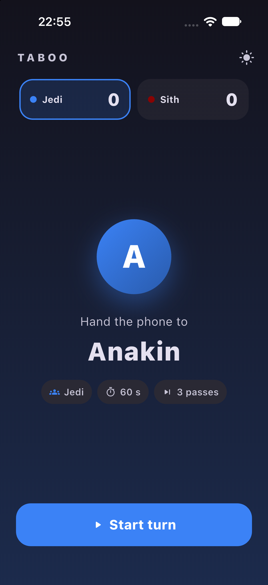
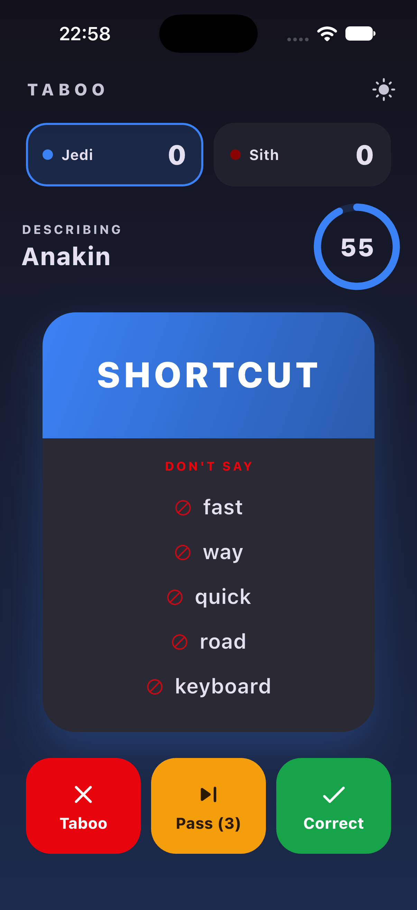

# Taboo

A Taboo word-guessing party game for one phone, built with Flutter on top of a pure, fully tested Dart game engine.

<p align="center">
  
  &nbsp;&nbsp;
  
</p>

## How to play

Two teams take turns. The describer sees a word and must get their team to say it **without using the forbidden words** on the card.

| Button | Effect |
|---|---|
| ✅ **Correct** | +1 for the team, next card |
| ❌ **Taboo** | −1 for the team (a forbidden word was said), next card |
| ⏭ **Pass** | skip the card — 3 passes per turn |

A random team starts. When time runs out, the phone goes to the other team and their next player describes. Once every team has played the same number of turns, a team that has reached the target score and is ahead wins (a tie plays another round). If the deck runs out, the cards already played are shuffled back in, so the game never stops early.

## Features

- Turn-based play on a single phone, with a "hand the phone to …" screen between turns
- Describers rotate inside each team
- Circular countdown that turns red in the last 10 seconds
- Animated card transitions, score animations and haptic feedback
- Winner / draw screen with *Play again*
- Light and dark theme (follows the phone, switchable in-game); each team has its own colour
- 2,176 general English cards, shuffled for every game

## Architecture

The interesting part of this project is the split between the **game engine** and the **UI**.

```
lib/
  domain/          ← game engine: pure Dart, no Flutter imports
    model/         ← GameState, GameConfig, Team, Player, Word
    game/          ← GameEvent + apply()
  ui/              ← Flutter widgets; only draws state and sends events
  data/            ← loads the word list; sample teams (until the setup screen exists)
assets/words/      ← en.json: 2,176 general cards; modes/: seed cards for topic modes
```

The whole game is one function:

```dart
GameState apply(GameState state, GameEvent event)
```

- **Events** are everything that can happen: `Correct`, `Taboo`, `Pass`, `SecondTick`, `TurnEnded`.
- **State is immutable.** `apply()` never changes the old state; it returns a new one (`copyWith`). Same input → same output.
- **The UI has exactly one line of game logic:** `setState(() => state = apply(state, event))`. Buttons and the timer only create events.

Because the engine doesn't know about Flutter, it is easy to test, and the plan is to run the same rules on a server (Java) for the online version, with the same tests.

The rules, edge cases and the design decisions behind them (why teams live in `GameConfig`, why describer order is stored on `Team`, why the deck is reshuffled when it runs out) are written up in **[docs/design.md](docs/design.md)**.

## Tests

```bash
fvm flutter test
```

- **24 engine tests** — scoring, reshuffling when the deck runs out, events after the game ends, turn changes, describer rotation, `GameState.initial` (incl. a random starting team), target score checked at the end of a round
- **3 widget tests** — starting a turn, scoring, using a pass, switching the theme
- **5 word list tests** — card count, 5 different forbidden words, no duplicates, no forbidden word that gives the card away

## Running it

The project uses [fvm](https://fvm.app) to pin the Flutter version.

```bash
dart pub global activate fvm
fvm install          # installs the version from .fvmrc
fvm flutter pub get
fvm flutter run      # pick an iOS simulator, Android emulator or Chrome
```

## Status and roadmap

- [x] **v1 engine** — rules, turns, describer rotation, tests
- [x] **v1 game screen** — playable on one phone
- [ ] Setup screen (team and player names, round length, target score)
- [x] Bigger word list loaded from JSON (2,176 general English cards)
- [ ] Game modes by topic (engineering, medicine, computer science, art, …)
- [ ] **v2** — online play in the same room (Spring Boot + WebSocket, join by QR code)
- [ ] **v3** — remote play with voice (WebRTC)
